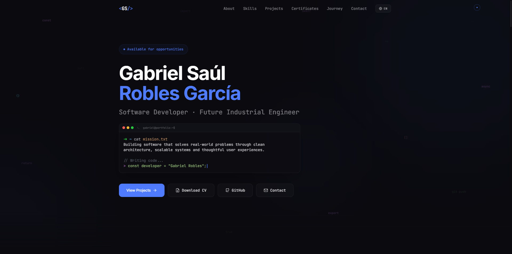

# Gabriel Saúl Robles García — Portfolio

> Software Developer · Future Industrial Engineer · Lima, Perú

[](https://github.com/gsrobles2705)
[](https://react.dev)
[](https://www.typescriptlang.org)
[](https://vitejs.dev)
[](https://tailwindcss.com)
[](https://vitest.dev)
[](https://github.com/gsrobles2705/portfolio/actions/workflows/ci.yml)



## Overview

Personal portfolio built with a developer-first aesthetic. Features bilingual support (EN/ES), smooth scroll-triggered animations, a custom cursor, and a terminal-inspired design language that reflects my background in systems programming and modern web development.

## Tech Stack

| Category | Technology |
|----------|------------|
| Framework | React 18 + TypeScript |
| Build Tool | Vite 5 |
| Styling | Tailwind CSS 3 |
| Animation | Framer Motion |
| Icons | Lucide React + React Icons |
| i18n | Custom lightweight context |
| Testing | Vitest + React Testing Library |

## Getting Started

```bash
# Clone the repository
git clone https://github.com/gsrobles2705/portfolio.git
cd portfolio

# Install dependencies
npm install

# Start development server
npm run dev

# Run tests
npm test

# Build for production
npm run build
```

## Project Structure

```
src/
├── components/      # React components (sections + UI)
├── context/         # Language context (EN/ES)
├── data/            # Typed data files (projects, skills, journey)
├── hooks/           # Custom hooks (scroll reveal, typewriter, spotlight)
├── test/            # Test setup and utilities
├── App.tsx          # Root component with lazy loading
└── index.css        # Global styles + Tailwind directives
```

## Key Features

- **Bilingual** — Full English/Spanish toggle with persistent preference
- **Accessible** — Respects `prefers-reduced-motion`, semantic HTML, improved contrast ratios
- **Performance** — Code-split sections with React.lazy, single font request, optimized animations
- **Typed** — Zero `any` usage; all data structures are fully typed
- **Responsive** — Mobile-first with touch-aware cursor detection
- **Tested** — Core hooks and context covered with unit tests

## Technical Decisions

### Why Lenis instead of native `scroll-behavior: smooth`?
Native smooth scroll works, but Lenis provides consistent easing curves across all browsers (including Safari, which handles it differently) and enables programmatic scroll-to with precise offsets. Given that navigation is the primary interaction in this single-page portfolio, the ~15kb cost is justified for UX consistency. Event delegation is used for anchor links so lazy-loaded sections are handled correctly without listener leaks.

### Why imperative refs in `useSpotlight` instead of `useState`?
Updating CSS custom properties via `ref.style.setProperty` avoids React re-renders on every `mousemove` event. With 60fps mouse tracking, `useState` would trigger 60 re-renders/second, destroying performance. This is a deliberate imperative escape hatch for animation-heavy interactions.

### Why ErrorBoundary per section?
Each section is lazy-loaded. If one chunk fails (network error, build issue), an unhandled error would crash the entire app. Per-section boundaries contain the failure and allow the rest of the portfolio to remain functional — a resilience pattern borrowed from micro-frontends.

### Why a custom i18n context instead of a library?
The translation surface is small (~50 keys) and static. Adding react-i18next would increase bundle size and complexity without proportional benefit. The custom `TranslationKey` union type provides compile-time safety and IDE autocomplete, which is often harder to achieve with dynamic key lookups in full i18n libraries.

## Roadmap

- [ ] Publish open-source projects with professional READMEs
- [ ] Add LinkedIn profile link when available
- [ ] Add E2E smoke tests with Playwright

## Contact

- **Email:** [gsrobles2705@gmail.com](mailto:gsrobles2705@gmail.com)
- **GitHub:** [@gsrobles2705](https://github.com/gsrobles2705)
- **Location:** Lima, Perú (GMT-5)

---

Crafted with precision by Gabriel Saúl Robles García.
